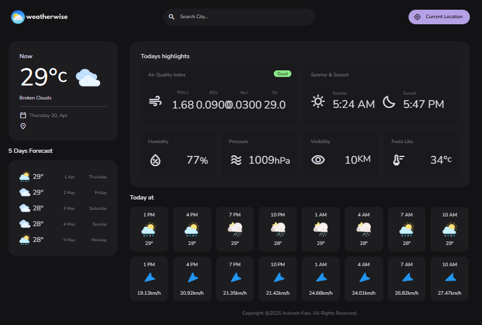

# 🌦️ WeatherWise – Modern Weather Web App

A clean and responsive weather application that provides real-time weather data, air quality index, and forecasts based on user location or city search.

---

## 🚀 Live Demo

🔗 https://your-netlify-link.netlify.app

---

## ✨ Features

* 🌍 Search weather by city name
* 📍 Get weather using current location
* 🌡️ Real-time temperature and conditions
* 📊 Air Quality Index (AQI)
* 🌅 Sunrise & Sunset timing
* 📅 5-day forecast
* 💨 Humidity, Pressure, Visibility, Feels Like

---

## 🛠️ Tech Stack

* HTML5
* CSS3
* JavaScript (ES6 Modules)
* Weather API

---

## 📸 Screenshot


---

## ⚙️ Installation & Setup

1. Clone the repository:

```bash
git clone https://github.com/your-username/weatherwise.git
```

2. Open the project:

```bash
cd weatherwise
```

3. Run using Live Server in VS Code

---


## 📌 Future Improvements

* 🌙 Dark/Light mode toggle
* 📱 Better mobile responsiveness
* 📍 Save favorite locations
* 🔔 Weather alerts

---

## 👨‍💻 Author

Avinash Kale

---

## ⭐ If you like this project

Give it a star ⭐ on GitHub!
